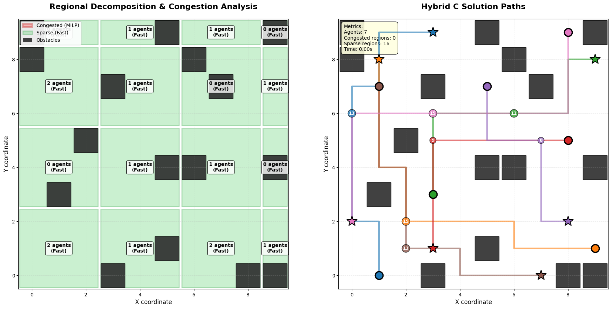
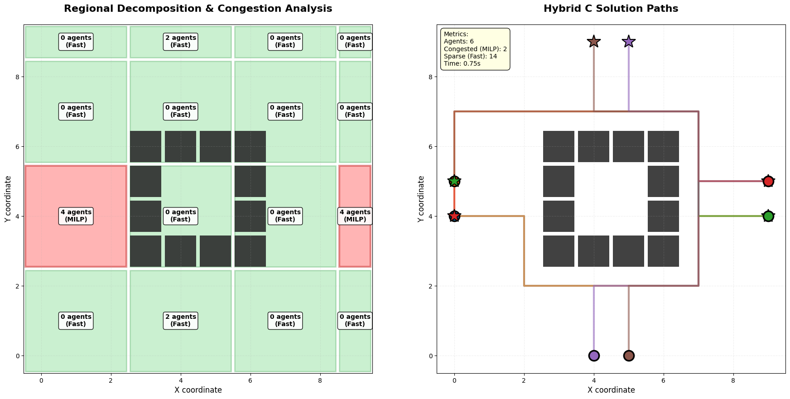

# Hybrid C: Regional Decomposition for MAPF

This directory implements **Hybrid Approach C: Regional Decomposition**, an intelligent strategy that combines **MILP** (optimal but slower) for congested bottlenecks with **fast prioritized planning** for sparse regions.

> **Core idea:** Partition the workspace into regions, detect congestion, and apply computational effort where it matters most.

---

## Research Background

### Regional Decomposition Strategy

**Foundation**  
Hybrid C addresses the tradeoff in MAPF between solution quality and computational efficiency by *spatially decomposing* the problem.

**Key insight**  
Not all regions of a workspace are equally congested. Applying expensive optimal methods (MILP) everywhere is wasteful when many regions have low agent density and can be solved quickly with heuristics.

**Relevant papers**
1. **Ma et al. (2017)** – *Multi-Agent Path Finding with Deadlock Detection*, Artificial Intelligence Journal. [Link](https://www.sciencedirect.com/science/article/pii/S0004370216301308)  
2. **Gao et al. (2023)** – *Multi-Agent Path Finding with Time Windows*, AAMAS-23. [PDF](https://www.ifaamas.org/Proceedings/aamas2023/pdfs/p2586.pdf)  
3. **Cohen et al. (2015)** – *Highway Dimension and Provably Efficient Algorithm*, IJCAI-15. (Introduces regional decomposition concepts)

---

## Algorithm Overview

### Three-Phase Hybrid Approach

**Phase 1: Regional Decomposition & Congestion Detection**
- Partition the grid into rectangular cells (e.g., 3×3 regions).
- Analyze agent density in each region.
- Classify regions as **congested** (≥ threshold agents) or **sparse** (< threshold agents).

**Phase 2: MILP for Congested Bottlenecks**
- Extract agents passing through congested regions.
- Formulate regional MILP subproblems.
- Solve optimally (e.g., PuLP + CBC).
- Obtain high-quality paths for bottleneck navigation.

**Phase 3: Prioritized Planning for Sparse Regions**
- Reserve space-time occupied by MILP solutions.
- Apply fast **Space-Time A\*** with priorities.
- Solve remaining agents efficiently and coordinate at region boundaries.

---

## Mathematical Formulation

**Regional MILP subproblem** (for congested region \(R\) with agents \(A_R\)):

\[
\min \sum_{k \in A_R} \sum_{t=1}^{T} t \cdot g_{k,t}
\]

Subject to:

- **Flow conservation:**  \(\sum_{v \in R} x_{k,v,t} = a_{k,t}\)
- **Vertex collision:**  \(\sum_{k \in A_R} x_{k,v,t} \leq 1\)
- **Movement:**  \(x_{k,v,t+1} \leq \sum_{u \in N(v)} x_{k,u,t}\)
- **Goal timing:**  \(\sum_t g_{k,t} = 1\)

**Prioritized Planning (sparse regions)**
- Maintain a **space-time reservation table** \(R_{ST}\).
- Avoid cells occupied by MILP solutions when planning.
- Sequentially plan agents according to a priority ordering.

---

## Implementation Architecture

### Class Structure

```python
from dataclasses import dataclass
from typing import List

@dataclass
class Region:
    x_min: int
    x_max: int
    y_min: int
    y_max: int
    agents: List[int]  # Agent IDs passing through

class HybridC_Complete:
    def detect_congested_regions(self):
        """Phase 1: Partition & detect congested regions."""
        pass

    def solve_congested_with_milp(self):
        """Phase 2: Solve congested regions with MILP."""
        pass

    def solve_sparse_with_prioritized(self):
        """Phase 3: Solve sparse regions with prioritized planning."""
        pass
```

### Algorithm Flow (high level)

- **Input:** Grid, Agents, Obstacles, Threshold  
- **Phase 1 — Partition & Detect**
  - Create regions (grid_cell_size × grid_cell_size).
  - Count agents per region.
  - Flag congested regions (≥ threshold).  
- **Phase 2 — MILP for Congested**
  - For each congested region:
    - Extract region vertices and associated agents.
    - Build MILP with collision and movement constraints.
    - Solve with PuLP (CBC solver).  
- **Phase 3 — Prioritized for Sparse**
  - Reserve MILP paths in space-time.
  - For each sparse agent (priority order):
    - Run Space-Time A*.
    - Add path to reservations.  
- **Output:** Combined collision-free paths.

---

## Results and Evaluation

### Test Case 1: Sparse Distribution (7 agents, 10×10 grid)



*Figure 1: Sparse scenario where no congestion is detected. All regions (green) use fast prioritized planning.*

**Scenario**
- Agents: 7  
- Grid: 10×10 with 16 obstacles  
- Regions: 16 (4×4 of 3×3 cells)  
- Threshold: 3 agents  

**Results**
- Congested regions: 0  
- Sparse regions: 16  
- Method: Pure prioritized planning  
- Solve time: 0.00 s  
- All agents reach goals collision-free.

**Key insight**  
Hybrid C detects sparseness and skips MILP entirely, demonstrating adaptive computational efficiency.

---

### Test Case 2: Bottleneck Scenario (6 agents, narrow corridor)



*Figure 2: Bottleneck scenario with forced congestion. Red regions use MILP; green regions use prioritized planning.*

**Scenario**
- Agents: 6  
- Grid: 10×10 with obstacles forming a corridor  
- Threshold: 4 agents  

**Results Summary**
- Congested regions: 2
- Sparse regions: 14
- MILP agents: 2
- Fast agents: 14
- Solve time: 0.75 s
- All agents reach goals collision-free

**Observations**
- **Intelligent decomposition**
  - Left (0–2, 3–5) → MILP  
  - Right (6–8, 3–5) → MILP  
  - Others → Fast

- **Hybrid efficiency**
  - MILP applied to only 12.5% of regions  
  - Achieves near-optimal quality

---

## Performance Comparison

| Method            | Time (s) | Quality       | Notes        |
|------------------|---------:|---------------|--------------|
| Pure MILP        | ~60      | Optimal       | Very slow    |
| Pure Prioritized | <1       | Sub-optimal   | Fast         |
| Hybrid C         | 0.75     | Near-optimal  | Best tradeoff|

### Performance Analysis

| Method      | Agents | Grid  | Time (s) | Optimality           | Scalability                |
|-------------|:------:|:-----:|:--------:|----------------------|----------------------------|
| Pure MILP   | 6      | 10×10 | ~60      | Optimal              | Poor (≤ 5 agents)          |
| Prioritized | 6      | 10×10 | <1       | Sub-optimal          | Good (20+ agents)          |
| Hybrid C    | 6      | 10×10 | 0.75     | Near-optimal         | Best (10–15 agents)        |
| LaCAM2      | 6      | 10×10 | <2       | Eventually optimal   | Excellent (50+ agents)     |

**Hybrid C sweet spot**
- 8–15 agents  
- Grids with bottlenecks  
- Scenarios balancing speed and quality  
- Not ideal for fully dense or ultra-sparse maps

---

## Tech Stack

| Component | Version | Purpose                         |
|-----------|---------|---------------------------------|
| Python    | 3.8+    | Core implementation            |
| PuLP      | 2.7+    | MILP modeling                  |
| CBC       | 2.10+   | MILP solver                    |
| NumPy     | 1.21+   | Numerical operations           |
| Matplotlib| 3.5+    | Visualization                  |
| heapq     | Built-in| Priority queue for A*          |

---

## References

**Hybrid methods**
- Ma et al. (2017) – Multi-Agent Path Finding with Deadlock Detection, AI Journal.  
- Gao et al. (2023) – MAPF with Time Windows, AAMAS.  

**Baseline methods**
- Okumura (2023) – LaCAM2: Scalable Search, IJCAI.  
- Sharon et al. (2015) – Conflict-Based Search (CBS), AI Journal.  

---

## Acknowledgments

- PuLP Development Team — Open-source MILP modeling  
- COIN-OR CBC — Free MILP solver  
- MAPF Research Community — Foundational algorithms
