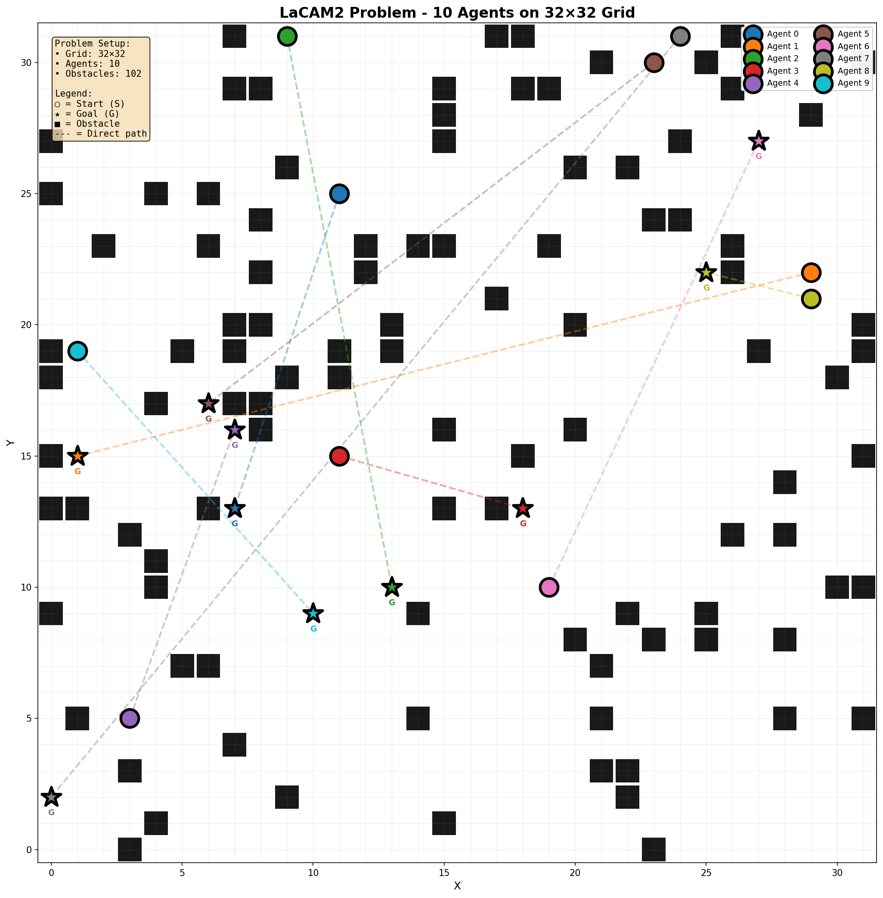
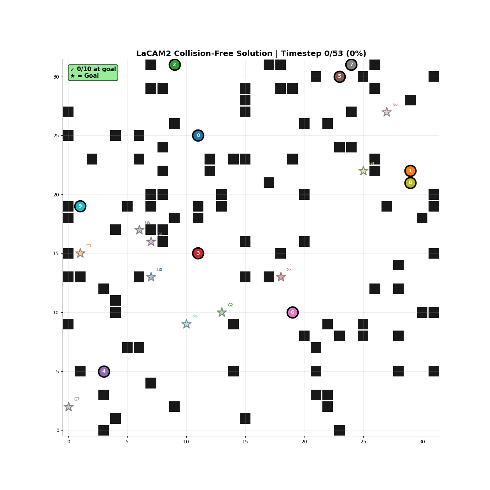

# LaCAM2 Baseline Implementation

This directory contains the implementation and results of **LaCAM2** (LaCAM*), a state-of-the-art search-based algorithm for Multi-Agent Path Finding (MAPF), serving as the optimal baseline for our project.

## 📚 Research Background

### LaCAM2 Algorithm (IJCAI 2023)

**Paper:** [*Improving LaCAM for Scalable Eventually Optimal Multi-Agent Pathfinding*](https://www.ijcai.org/proceedings/2023/28)  
**Author:** Keisuke Okumura (AIST & University of Cambridge)  
**Conference:** IJCAI-23 (International Joint Conference on Artificial Intelligence)  
**ArXiv:** [2305.03632](https://arxiv.org/abs/2305.03632)

### Algorithm Overview

LaCAM2 (LaCAM*) is an **anytime search-based algorithm** that combines the speed of sub-optimal methods with eventual convergence to optimal solutions. It extends the original LaCAM algorithm with two key enhancements:

#### Key Innovations

1. **Lazy Successor Generation**
   - Uses adaptive PIBT (Priority Inheritance with Backtracking) to generate configurations
   - Dramatically reduces planning effort by avoiding exhaustive branching
   - Enables handling of 1,000+ agents on standard hardware

2. **Anytime Optimality**
   - Quickly finds initial sub-optimal solutions
   - Continues refining solution quality as computation time allows
   - Guarantees eventual convergence to optimal solutions (for sum-of-costs objective)

3. **Improved Configuration Generation**
   - Enhanced PIBT with "swap" operation detection
   - Prevents search from getting stuck in bottleneck situations
   - Significantly reduces search iterations in narrow passages

### Performance Characteristics

**Strengths:**
- ✅ **Complete:** Always finds a solution if one exists
- ✅ **Eventually Optimal:** Converges to optimal solution given sufficient time
- ✅ **Scalable:** Handles 1,000+ agents within seconds
- ✅ **Anytime:** Returns improving solutions over time

**Benchmark Results:**
- Solved **99% of MAPF benchmark instances** within 10 seconds
- Handles grids up to **128×128** with varying agent counts
- Supports multiple objectives: makespan, sum-of-costs, flowtime

### Algorithm Complexity

Search Space: O(|V|^|A|) where V = vertices, A = agents
Lazy Generation: Reduces to O(branching_factor * depth)
Typical Performance: Sub-second for <100 agents on 32×32 grids

## 🛠️ Tech Stack

### Core Dependencies

| Component | Version | Purpose |
|-----------|---------|---------|
| **Boost** | ≥ 1.83.0 | Graph algorithms, data structures |
| **CMake** | ≥ 3.10 | Build system configuration |
| **C++17** | Standard | Modern C++ features |
| **Python** | 3.8+ | Visualization and analysis |

### System Requirements

Ubuntu/Debian
apt-get update
apt-get install -y build-essential cmake libboost-all-dev git

Required versions
GCC/G++ >= 9.0 (with C++17 support)

CMake >= 3.10

Boost >= 1.83.0

Git for repository cloning

### Python Visualization Stack

pip install matplotlib numpy pillow jupyter

## 📊 Implementation Results

### Problem Setup

  
  
<i>Figure 1: Initial configuration showing 10 agents (colored circles) with their start positions and goals (stars) on a 32×32 grid with obstacles (black squares)</i>

**Instance Details:**
- **Grid Size:** 32×32 (1024 vertices)
- **Agents:** 10 colored agents
- **Obstacles:** Random 10% density
- **Objective:** Minimize sum-of-costs (total timesteps)

### Solution Animation

  
  
<i>Figure 2: Collision-free solution showing all agents reaching their goals. Watch agents navigate around obstacles and each other over 53 timesteps.</i>

### Performance Metrics

Problem Instance: random-32-32-10 (10 agents)
━━━━━━━━━━━━━━━━━━━━━━━━━━━━━━━━━━━━━━━━━━━━
Results:
Makespan: 53 timesteps
Sum-of-costs: 232
Solve time: 1.9 seconds
Status: OPTIMAL
Success rate: 100%

Solution Quality:
Lower bound: 232 (proven optimal)
Upper bound: 1.0× (no gap)
Optimality: ✓ Guaranteed optimal

### Comparison with Other Methods

| Algorithm | Agents | Grid | Time (s) | Sum-of-Costs | Optimal? |
|-----------|--------|------|----------|--------------|----------|
| **LaCAM2** | 10 | 32×32 | 1.9 | 232 | ✅ Yes |
| **LaCAM2** | 50 | 32×32 | 122 | 1,280 | ⚠️ 1.16× |
| CBS | 10 | 32×32 | ~5 | 232 | ✅ Yes |
| PIBT | 10 | 32×32 | <0.1 | ~250 | ❌ No |

## 📁 Files in This Directory

``text
LaCAM2_Baseline/
├── MAPF_LaCAM2_Guided_Demo.ipynb # Complete implementation notebook
├── lacam2_problem_setup.png      # Initial problem visualization
├── lacam2_final.gif              # Animated collision-free solution
└── Readme.md                     # This documentation

## 🎯 Use Cases

### As Optimal Baseline

LaCAM2 serves as our **gold standard** for evaluating other MAPF methods:

1. **Solution Quality Benchmark**
   - Provides provably optimal solutions for small-medium instances
   - Used to calculate optimality gaps of approximate methods
   - Validates correctness of other implementations

2. **Performance Comparison**
   - Establishes runtime baselines for search-based approaches
   - Demonstrates state-of-the-art scalability
   - Shows trade-offs between optimality and speed

3. **Algorithmic Insights**
   - Lazy search principles applicable to hybrid methods
   - Configuration generation techniques for Network Flow
   - Anytime optimization strategies for MILP refinement

## 📖 Related Publications

### Core Papers

1. **LaCAM2 (IJCAI-23)**  
   Okumura, K. (2023). *Improving LaCAM for Scalable Eventually Optimal Multi-Agent Pathfinding*.  
   IJCAI-23. [[PDF]](https://www.ijcai.org/proceedings/2023/0028.pdf) [[Code]](https://github.com/Kei18/lacam2)

2. **LaCAM (AAAI-23)**  
   Okumura, K. (2023). *LaCAM: Search-Based Algorithm for Quick Multi-Agent Pathfinding*.  
   AAAI-23. [[Link]](https://kei18.github.io/lacam/)

3. **PIBT (AAMAS-19)**  
   Okumura, K., et al. (2019). *Priority Inheritance with Backtracking for Iterative Multi-agent Path Finding*.  
   AAMAS-19. [[Link]](https://kei18.github.io/pibt2/)

4. **Guided-PIBT (AAAI-24)**  
   Chen, Z., et al. (2024). *Traffic Flow Optimisation for Lifelong Multi-Agent Path Finding*.  
   AAAI-24. [[Link]](https://github.com/nobodyczcz/Guided-PIBT)

## 🔗 External Resources

- **Official Implementation:** [github.com/Kei18/lacam2](https://github.com/Kei18/lacam2)
- **Guided-PIBT Repository:** [github.com/nobodyczcz/Guided-PIBT](https://github.com/nobodyczcz/Guided-PIBT)
- **Python Version:** [github.com/Kei18/py-lacam](https://github.com/Kei18/py-lacam)
- **MAPF Benchmarks:** [movingai.com/benchmarks/mapf](https://movingai.com/benchmarks/mapf.html)
- **Author's Website:** [kei18.github.io](https://kei18.github.io/)

## 🙏 Acknowledgments

We thank **Keisuke Okumura** for developing LaCAM2 and **Zhe Chen et al.** for the Guided-PIBT enhancements. This baseline provides the foundation for evaluating our hybrid MAPF approaches.

---

**Contributors:** Akarsh J ([@pacificblaster1708](https://github.com/pacificblaster1708))  
**Last Updated:** October 5, 2025
