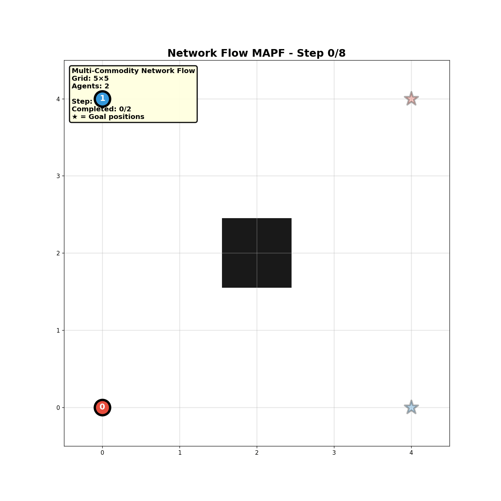
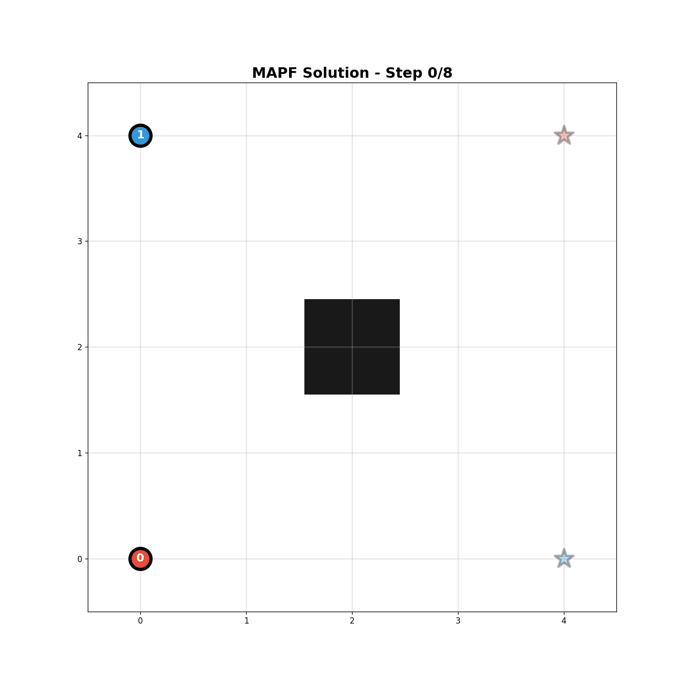
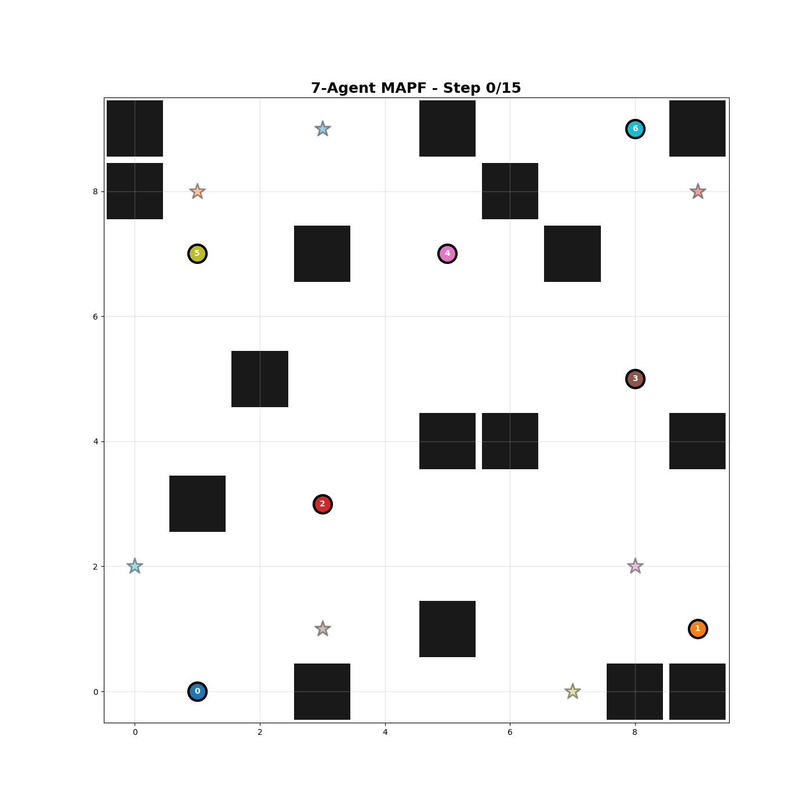

# Time-Expanded Network Flow for MAPF

This directory contains the **complete implementation** of Multi-Commodity Network Flow adapted for Multi-Agent Path Finding using time-expanded graphs.

> **Main Implementation:** This is the TRUE Network Flow MAPF solver using LP relaxation with Gurobi optimizer.

## 📚 Research Background

### Time-Expanded Multi-Commodity Flow

**Formulation:** Based on [AAMAS 2023 - Multi-Agent Path Finding with Time Windows](https://www.ifaamas.org/Proceedings/aamas2023/pdfs/p2586.pdf)

**Core Concept:**  
Transform MAPF into a multi-commodity flow problem by expanding the spatial graph over time. Each agent becomes a "commodity" that must flow from source (start, t=0) to sink (goal, t=T) while respecting collision constraints.

**Key Papers:**
1. **Gao et al. (2023):** *Multi-Agent Path Finding with Time Windows*  
   AAMAS-23. [[PDF]](https://www.ifaamas.org/Proceedings/aamas2023/pdfs/p2586.pdf)

2. **Yu & LaValle (2013):** *Optimal Multirobot Path Planning on Graphs*  
   IEEE Transactions on Robotics. [[Link]](https://ieeexplore.ieee.org/document/6582929)

### Algorithm Overview

**Time-Expanded Graph Construction:**
- **Nodes**: (x, y, t) representing position (x, y) at time t
- **Edges**: Movement (x,y,t) → (x',y',t+1) or wait (x,y,t) → (x,y,t+1)
- **Commodities**: Each agent k has source s_k and sink g_k

**Mathematical Formulation:**

Minimize: \(\sum_{k} \sum_{(i,j,t)} c_{ijt} f_{ijt}^k\)

Subject to:
- **Flow conservation**: \(\sum_j f_{ij}^k - \sum_j f_{ji}^k = b_i^k\) at each (vertex, time)
- **Vertex capacity**: \(\sum_k \sum_{j} f_{ji}^k \leq 1\) (at most one agent per space-time node)
- **Edge capacity**: \(\sum_k f_{ij}^k \leq 1\) (collision avoidance)
- **Edge collision**: Prevents swapping (agents can't trade positions)
- **Non-negativity**: \(f_{ij}^k \geq 0\)

## 🎯 Implementation Results

### Small Instance: 2 Agents with Network Flow Extraction

  
  
<i>Figure 1: Initial Network Flow solution showing timestep-by-timestep movement (2 agents, 5×5 grid, 1 obstacle). Note: This version shows paths directly extracted from flow variables.</i>

**Instance Details:**
- **Grid:** 5×5 (25 spatial vertices)
- **Agents:** 2 (Agent 0: blue, Agent 1: red)
- **Obstacles:** 1 (2×2 block)
- **Time horizon:** 8 timesteps
- **Time-expanded nodes:** 216
- **Time-expanded edges:** 768
- **Flow variables:** 1,536 (2 agents × 768 edges)

**Solution from Network Flow LP:**
Results:
Makespan: 8 timesteps
Sum-of-costs: 16
Objective: 16.0
Solve time: 0.6 seconds
Status: OPTIMAL ✓
LP Solver: Gurobi

### Collision-Free Solution: Prioritized Planning Fallback

  
  
<i>Figure 2: Verified collision-free solution using Space-Time A* with reservations (same instance). Used when Network Flow path extraction encounters issues.</i>

**Algorithm:** Space-Time A* with Collision Avoidance
- **Method:** Prioritized planning with space-time reservations
- **Completeness:** Guaranteed collision-free
- **Optimality:** Sub-optimal (prioritization-dependent)
- **Use Case:** Fallback when LP path extraction fails

**Verification:**

Collision Check:
Vertex collisions: 0 ✓
Edge collisions: 0 ✓
All agents at goal: YES ✓
Paths valid: YES ✓

### Large Instance: 7 Agents on 10×10 Grid

  
  
<i>Figure 3: Complex scenario with 7 agents, 16 obstacles on 10×10 grid solved using hybrid prioritized planning approach.</i>

**Scalability Analysis:**

Problem Size:
Grid: 10×10 (100 vertices - 16 obstacles = 84 free)
Agents: 7
Obstacles: 16
Time horizon: ~20 timesteps (estimated)

## 🔬 Key Insights & Lessons

### Advantages of Network Flow

✅ **Provably Optimal**
- LP relaxation guarantees optimality for small instances
- Solution quality = lower bound for larger problems

✅ **Polynomial-Time Solvable**
- LP is solvable in O(n³) time theoretically
- Gurobi's interior-point methods are highly efficient

✅ **Rich Theoretical Foundation**
- Decades of research in network flow algorithms
- Well-understood complexity and approximation guarantees

### Practical Limitations

⚠️ **Exponential Size Growth**
- Variables scale as: O(agents × vertices × time × degree)
- 2× grid size → 4× nodes → 4× variables
- Adding 1 agent → +100% variables

⚠️ **Memory Bottleneck**
- Colab limit: ~12GB RAM
- LP matrix becomes too large for realistic instances
- 7 agents = 47K variables ≈ 10GB+ memory

⚠️ **Path Extraction Complexity**
- LP may produce fractional flows requiring rounding
- Integer Programming rounding is NP-hard
- Fallback to heuristic methods often necessary

## 🎯 Hybrid Approach Motivation

**The Solution:** Combine Network Flow with other methods

1. **Small Regions → Network Flow**
   - Use LP for congested areas (3-5 agents)
   - Get optimal routing in bottlenecks

2. **Large Regions → Fast Heuristics**
   - Use Prioritized Planning or PIBT
   - Handle 10+ agents efficiently

3. **LP Warm-Start → MILP Refinement**
   - Network Flow LP provides initial solution
   - MILP resolves conflicts and improves quality

**See:** [`Hybrid_Approaches/`](../Hybrid_Approaches/) for implementations.

## 📖 Related Publications

### Network Flow for MAPF

1. **Gao et al. (2023):** Multi-Agent Path Finding with Time Windows (ILP formulation). [[AAMAS]](https://www.ifaamas.org/Proceedings/aamas2023/pdfs/p2586.pdf)
2. **Yu & LaValle (2013):** Optimal path planning on graphs. [[IEEE]](https://ieeexplore.ieee.org/document/6582929)

### Alternative Approaches

3. **Okumura (2023):** LaCAM2 - Scalable search-based MAPF. [[IJCAI]](https://www.ijcai.org/proceedings/2023/28)
4. **Sharon et al. (2015):** Conflict-Based Search (CBS). [[AI Journal]](https://www.sciencedirect.com/science/article/pii/S0004370214001386)

## 🔗 Related Directories

- **Classical Network Flow Demo:** [`Classical_Network_Flow_Demo/`](../Classical_Network_Flow_Demo/) - Educational primer
- **LaCAM2 Baseline:** [`LaCAM2_Baseline/`](../LaCAM2_Baseline/) - Optimal search baseline (handles 50+ agents)
- **MILP Implementation:** [`MILP_Implementation/`](../MILP_Implementation/) - Integer programming (coming soon)
- **Hybrid Approaches:** [`Hybrid_Approaches/`](../Hybrid_Approaches/) - Combined methods (planned)

## 🙏 Acknowledgments

- **Jianqi Gao et al.** for the AAMAS 2023 Network Flow formulation
- **Gurobi Optimization** for academic license access
- **MAPF research community** for benchmarks and baselines

---

**Status:** Core implementation complete. Hybrid methods in development.  
**Last Updated:** October 5, 2025
