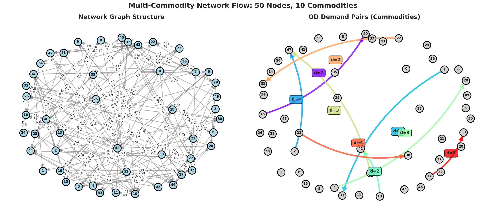

# Classical Multi-Commodity Network Flow Demo

This directory contains an **educational demonstration** of classical multi-commodity network flow optimization, serving as a conceptual primer before diving into the MAPF-specific time-expanded formulation.

> **Note:** This is **NOT** the main MAPF Network Flow implementation. For the actual MAPF solver using time-expanded graphs, see: [`Network_Flow_Implementation/`](../Network_Flow_Implementation/)

## 🎯 Purpose

This demo illustrates core network flow concepts:
- Multi-commodity flow on general networks
- Origin-Destination (OD) demand pairs
- Column generation algorithm
- Flow conservation and capacity constraints

**Educational Goal:** Understand classical network flow before adapting it to MAPF's time-expanded formulation.

## 📊 Visualization

  
  
<i>Left: Network structure (50 nodes, 146 edges) with capacities (C) and costs ($). Right: 10 commodity OD pairs with demand values (d).</i>

## 🔧 Problem Instance

**Network Configuration:**
- **Nodes:** 50 (randomly generated positions)
- **Edges:** 146 directed connections
- **Commodities:** 10 distinct OD pairs
- **Edge Capacities:** Random (5-20 units)
- **Edge Costs:** Random ($1-10 per unit flow)
- **Total Demand:** 39 units across all commodities

**Optimization Objective:**  
Minimize total flow cost: \(\min \sum_{k} \sum_{(i,j)} c_{ij} f_{ij}^k\)

**Subject to:**
- Flow conservation at each node
- Capacity constraints on edges
- Non-negativity of flows

## 📚 Algorithm: Column Generation

**Method:** Iterative LP relaxation with dual pricing

1. **Master Problem (Restricted LP)**
   - Solve flow allocation with current columns
   - Extract dual variables (shadow prices)

2. **Pricing Subproblem**
   - Find shortest path for each commodity using dual prices
   - Generate new columns (routes) with negative reduced cost

3. **Iteration**
   - Add improving columns to master problem
   - Repeat until no profitable columns exist

4. **Convergence**
   - Optimal when all reduced costs ≥ 0

**Performance:**
-Convergence Statistics:
-Total Iterations: 321
-Initial Objective: 3,176,000.00
-Final Objective: 3,439,373.87
-Optimality Gap: 0.00 (proven optimal)
-Solve Time: ~60 seconds

## 🛠️ Tech Stack

| Component | Version | Purpose |
|-----------|---------|---------|
| **Python** | 3.8+ | Implementation |
| **Gurobi** | 12.0+ | LP solver |
| **NetworkX** | 3.5+ | Graph algorithms |
| **NumPy** | 2.0+ | Numerical ops |
| **Pandas** | 2.2+ | Data handling |
| **Matplotlib** | 3.10+ | Visualization |

## 🔗 Differences from MAPF Network Flow

| Aspect | Classical Flow (This Demo) | MAPF Network Flow |
|--------|---------------------------|-------------------|
| **Graph Type** | Static spatial network | Time-expanded (space + time) |
| **Nodes** | 50 spatial locations | 216+ (grid × timesteps) |
| **Commodities** | 10 abstract OD pairs | 2+ agents (robots) |
| **Edges** | 146 spatial connections | 768+ (movement + wait actions) |
| **Constraints** | Capacity limits | Collision avoidance |
| **Objective** | Minimize flow cost | Minimize makespan/sum-of-costs |
| **Solution** | Flow values | Agent paths over time |
| **Application** | Transportation, logistics | Multi-robot coordination |

## 🎓 Learning Path

**Step 1: Understand This Demo**
- ✅ Classical multi-commodity flow
- ✅ Column generation algorithm
- ✅ Capacity and flow conservation

**Step 2: Move to MAPF Network Flow**
- Add temporal dimension (time-expanded graph)
- Convert agents to commodities
- Add collision avoidance constraints
- **See:** [`Network_Flow_Implementation/`](../Network_Flow_Implementation/)

**Step 3: Explore Hybrid Methods**
- Combine Network Flow LP with MILP refinement
- **See:** [`Hybrid_Approaches/`](../Hybrid_Approaches/)

## 📖 References

### Classical Network Flow

1. **Ahuja, Magnanti & Orlin (1993):** *Network Flows: Theory, Algorithms, and Applications*  
   Prentice Hall. [[Book]](https://www.amazon.com/Network-Flows-Theory-Algorithms-Applications/dp/013617549X)

2. **Yuzheng Feng (2018):** *Multi-Commodity Network Flow Implementation*  
   GitHub Repository. [[Link]](https://github.com/yuzhenfeng2002/Multi-Commodity-Network-Flow)

### Network Flow for MAPF

3. **Yu & LaValle (2013):** *Optimal Multirobot Path Planning on Graphs*  
   IEEE Transactions on Robotics. [[Link]](https://ieeexplore.ieee.org/document/6582929)

4. **Gao et al. (2023):** *Multi-Agent Path Finding with Time Windows*  
   AAMAS-23. [[PDF]](https://www.ifaamas.org/Proceedings/aamas2023/pdfs/p2586.pdf)

## 🔗 Related Directories

- **Main MAPF Network Flow:** [`Network_Flow_Implementation/`](../Network_Flow_Implementation/) - Time-expanded MAPF solver ⭐
- **MILP Implementation:** [`MILP_Implementation/`](../MILP_Implementation/) - Exact integer programming
- **LaCAM2 Baseline:** [`LaCAM2_Baseline/`](../LaCAM2_Baseline/) - Optimal search-based solver
- **Hybrid Approaches:** [`Hybrid_Approaches/`](../Hybrid_Approaches/) - Combined methods

## 🙏 Acknowledgments

- **Yuzheng Feng** for the original multi-commodity flow implementation
- **Gurobi Optimization** for academic license access
- Classical optimization community for foundational algorithms

---

---
**Contributors:** Akarsh J ([@pacificblaster1708](https://github.com/pacificblaster1708))  
**Last Updated:** October 5, 2025

